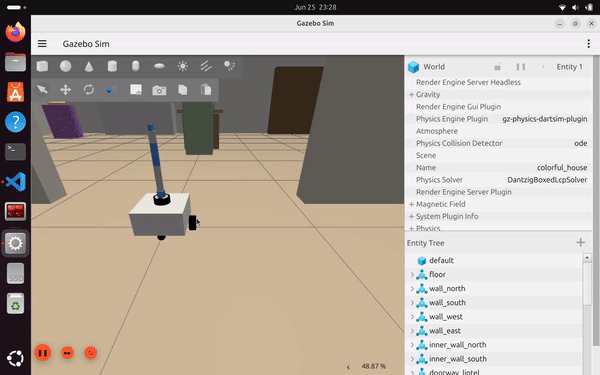

# bot — ROS 2 Mobile Manipulator (SLAM · Nav2 · MoveIt 2)

A from-scratch ROS 2 robot built for learning the full modern robotics stack:
a differential-drive mobile base that maps and navigates autonomously, plus a
5-DOF arm planned with MoveIt 2 and an RGB-D camera — all simulated in Gazebo.

> Platform: **ROS 2 Jazzy** · **Gazebo Harmonic (gz-sim 8)** · Ubuntu 24.04

---

## Demo



*Full video: [`media/demo.mp4`](media/demo.mp4) — Gazebo physics (arm + driving) and the RViz MoveIt MotionPlanning workflow.*

---

## Features

| Capability | Stack | Package |
|-----------|-------|---------|
| Differential-drive base | `gz-sim-diff-drive` | `bot_gazebo`, `bot_description` |
| 2D LiDAR | `gpu_lidar` sensor + `ros_gz_bridge` | `bot_description` |
| RGB-D camera | `rgbd_camera` sensor (RGB + depth + pointcloud) | `bot_description` |
| SLAM mapping | `slam_toolbox` | `bot_navigation` |
| Autonomous navigation | Nav2 (AMCL, NavFn, RPP controller) | `bot_navigation` |
| Frontier exploration | custom explorer node | `bot_navigation` |
| 5-DOF arm motion planning | MoveIt 2 (OMPL) + `ros2_control` | `bot_moveit_config`, `bot_description` |

---

## Packages

```
src/
├── bot_description/      Robot model (URDF/xacro), ros2_control, RViz configs
│   ├── urdf/
│   │   ├── bot.urdf.xacro        top-level include
│   │   ├── robot_core.xacro      chassis, drive wheels, casters
│   │   ├── lidar.xacro           2D LiDAR link + gz sensor
│   │   ├── camera.xacro          RGB-D camera link + gz sensor
│   │   ├── arm.xacro             5-DOF arm links + joints
│   │   ├── ros2_control.xacro    arm hardware interface (gazebo | mock)
│   │   ├── gazebo_control.xacro  diff-drive + joint-state plugins
│   │   └── inertial_macros.xacro inertia helper macros
│   └── config/arm_controllers.yaml   controller_manager (Gazebo)
│
├── bot_gazebo/           Gazebo world, bridge, sim launch
│   ├── worlds/empty.sdf          colorful_house world (250 Hz physics)
│   ├── config/gz_bridge.yaml     gz <-> ROS topic bridge
│   └── launch/sim.launch.xml     world + robot + bridge + controller + RViz
│
├── bot_navigation/       SLAM + Nav2
│   ├── config/nav2_params.yaml
│   ├── launch/nav2.launch.xml
│   ├── maps/                     saved maps (.pgm/.yaml)
│   └── explore.py                custom frontier explorer
│
└── bot_moveit_config/    MoveIt 2 configuration for the arm
    ├── config/  bot.srdf · kinematics.yaml · joint_limits.yaml
    │            moveit_controllers.yaml · ros2_controllers.yaml · moveit.rviz
    └── launch/  move_group.launch.py · moveit_rviz.launch.py · demo.launch.py
```

---

## Prerequisites

```bash
# ROS 2 Jazzy + Gazebo Harmonic assumed installed.
sudo apt update
sudo apt install -y \
  ros-jazzy-ros-gz \
  ros-jazzy-slam-toolbox \
  ros-jazzy-navigation2 ros-jazzy-nav2-bringup \
  ros-jazzy-moveit \
  ros-jazzy-ros2-control ros-jazzy-ros2-controllers \
  ros-jazzy-gz-ros2-control
```

## Build

```bash
cd ~/ros2_ws2
colcon build --symlink-install
source install/setup.bash
```

---

## Usage

### 1. Mobile base — drive + sensors in Gazebo
```bash
ros2 launch bot_gazebo sim.launch.xml
# drive it:
ros2 run teleop_twist_keyboard teleop_twist_keyboard   # or publish /cmd_vel
```
Topics: `/scan` (LiDAR), `/camera/image`, `/camera/depth_image`, `/camera/points`,
`/odom`, `/tf`, `/clock`.

### 2. SLAM — build a map
```bash
ros2 launch bot_gazebo sim.launch.xml
ros2 launch slam_toolbox online_async_launch.py use_sim_time:=true
# drive around, then save:
ros2 run nav2_map_server map_saver_cli -f ~/ros2_ws2/src/bot_navigation/maps/my_map
```

### 3. Autonomous navigation (Nav2)
```bash
ros2 launch bot_gazebo sim.launch.xml          # terminal 1
ros2 launch bot_navigation nav2.launch.xml     # terminal 2
# In RViz: set "2D Pose Estimate", then "2D Goal Pose".
```

### 4. Arm motion planning with MoveIt 2

**Fast, RViz-only (no physics — recommended for arm work):**
```bash
ros2 launch bot_moveit_config demo.launch.py
```
In the **MotionPlanning** panel: set a Goal State (`ready` / `home`) or drag the
interactive marker, then **Plan & Execute**.

**Full Gazebo physics (arm + base together):**
```bash
ros2 launch bot_gazebo sim.launch.xml rviz:=false   # terminal 1
ros2 launch bot_moveit_config move_group.launch.py  # terminal 2
ros2 launch bot_moveit_config moveit_rviz.launch.py # terminal 3
```

---

## How the arm works (the MoveIt 2 pipeline)

```
RViz goal ─▶ move_group ─▶ IK (KDL) + motion planning (OMPL)
                    │
                    ▼  time-parameterized JointTrajectory
          arm_controller (JointTrajectoryController)
                    │
                    ▼  position commands per joint
        ros2_control hardware  ── gazebo: gz_ros2_control (physics)
                                └─ mock:   mock_components/GenericSystem
                    │
                    ▼
              joints move ─▶ /joint_states ─▶ RViz updates
```

Four layers, each a config file:
1. **Geometry** — `arm.xacro` (links + revolute joints, 5 DOF).
2. **Control** — `ros2_control.xacro` + a controllers YAML (JointTrajectoryController).
   The hardware backend is selectable via the `sim_mode` xacro arg
   (`gazebo` for physics, `mock` for fast RViz-only).
3. **Planning** — `bot_moveit_config` (SRDF group + named poses, KDL kinematics,
   joint limits, OMPL pipeline, controller mapping).
4. **UI** — RViz MotionPlanning panel.

---

## Performance notes

The RGB-D **pointcloud** and default **1000 Hz physics** are the two biggest
real-time-factor (RTF) costs in Gazebo. This project tunes both:

| Setting | Value | Why |
|--------|-------|-----|
| Camera resolution | 320×240 @ 10 Hz | pointcloud cost scales with pixels × rate |
| Physics step | `0.004 s` (250 Hz) | 4× less solver work than the 1000 Hz default |

Result: **~9% → ~56% RTF** on this machine. For pure arm work, use the
mock-hardware `demo.launch.py` (no physics, full speed).

---

## License

MIT
